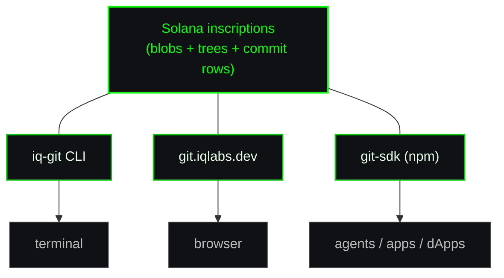

<Note>
On-chain Git stores commit history, file blobs, and per-commit trees inside
Solana inscriptions via the [Solana SDK](/docs-typescript). The CLI, the
browser frontend, and the embeddable SDK all read and write the same
on-chain data — anything one of them can do, the others can read.
</Note>

## The stack

Three pieces, one source of truth:

<CardGroup cols={3}>
  <Card title="iq-git CLI" icon="terminal" href="#cli-github-on-your-laptop">
    GitHub workflow from your shell: `iqgit init`, `commit`, `push`, `clone`.
  </Card>
  <Card title="On-Chain GitHub" icon="globe" href="#on-chain-github-git-iqlabs-dev">
    Browse and deploy repos from [git.iqlabs.dev](https://git.iqlabs.dev) —
    no install, just a wallet.
  </Card>
  <Card title="git-sdk" icon="code" href="#embed-on-chain-git-the-sdk">
    Drop on-chain Git into any agent, app, or dApp with one import.
  </Card>
</CardGroup>

---

## CLI: GitHub on your laptop

Use [`@iqlabs-official/iq-git-cli`](https://www.npmjs.com/package/@iqlabs-official/iq-git-cli)
when you want the familiar `git` flow but every commit lands on Solana
instead of a centralized server.

### Install

```bash
npm install -g @iqlabs-official/iq-git-cli
```

Once installed, `iqgit` is available globally.

### Push your first repo

```bash
iqgit init                        # create local .iqgit/
iqgit create my-app --public      # register repo on chain
iqgit add .
iqgit commit -m "first"
iqgit push                        # uploads blobs + tree + commit row
```

The first write command walks you through:

1. **Wallet** — generate a new Solana keypair, or point at an existing
   keypair JSON. Stored in `~/.iq-git/wallets/default.json`.
2. **RPC URL** — needed for any chain interaction. Helius works great
   on the free tier. Saved to `~/.iq-git/.env`.

Read-only commands (`clone`, `log`, `registry`) don't prompt for a wallet
at all — anyone can pull a public repo with zero setup.

### Clone someone else's repo

```bash
iqgit clone <owner>/<repo>
```

`<owner>` is a Solana wallet address (the repo creator); `<repo>` is the
human-readable name they registered. The CLI walks the on-chain commit
chain, fetches each blob, and writes the files to disk.

### Commands

| Command | Purpose |
|---|---|
| `iqgit init` | Create local `.iqgit/` (no chain interaction). |
| `iqgit create <name>` | Register a new repo on chain. |
| `iqgit add` / `iqgit reset` | Stage / unstage files for the next commit. |
| `iqgit commit -m "..."` | Snapshot staged paths locally. No chain write. |
| `iqgit push` | Upload pending commits to chain. **Resume-safe.** |
| `iqgit clone <owner>/<repo>` | Pull the latest snapshot. |
| `iqgit restore [commitId]` | Restore working tree to a specific commit. |
| `iqgit log` | Print commit history. |
| `iqgit status` | 4-tier diff: HEAD vs. pending vs. staged vs. working tree. |
| `iqgit registry` | Browse the public on-chain repo gallery. |
| `iqgit wallet new\|show\|balance\|repos` | Manage your keypair. |

### How `push` works

Each push writes three kinds of records:

1. **Blobs** — file contents, one inscription per unique hash.
2. **Tree** — JSON map of `{ path: { txId, hash } }`, one per commit.
3. **Commit row** — `{ id, message, treeTxId, parentCommitId, timestamp, author }`.

`commit` builds these locally; `push` uploads them. Splitting the two means
you can batch many commits into a single push and amortize Solana fees.

### Resume on failure

`push` is checkpointed end-to-end:

- Each blob's `{ hash → txId }` is appended to
  `.iqgit/upload-cache.json` on success, synchronously flushed.
- The tree's txId and the commit row's signature are persisted into the
  pending commit's `meta.json` between steps.

If the push dies partway (network blip, RPC error, Ctrl-C), the next
`iqgit push` resumes from the last checkpoint. Already-uploaded blobs
are reused from cache instead of being re-inscribed.

### Upload speed

Default speed is `light` — the Helius free-tier friendly setting. On a
paid RPC, dial it up by preset or by raw RPS / concurrency:

```bash
# preset name
iqgit config speed heavy                # save as global default
iqgit push --speed extreme              # one-off override

# raw dials (win over the preset; any subset works)
iqgit config rps 80                     # global default maxRps
iqgit push --rps 120 --concurrency-upload 30
```

Available presets: `light` | `medium` | `heavy` | `extreme`. Raw flags:
`--rps`, `--concurrency`, `--concurrency-upload` (and matching `iqgit
config` keys: `rps`, `concurrency`, `concurrencyUpload`).

### Gateway routing

Read-heavy commands (`log`, `registry`, `clone`, `status`) route through
the IQ Gateway HTTP cache by default, with raw RPC as the final fallback.
This sidesteps RPC method limits on bulk table reads.

| `GATEWAY_URL` | Behavior |
|---|---|
| (unset, default) | 3-gateway chain → RPC fallback (recommended) |
| `https://my.gateway` | Single override → RPC fallback |
| `url1,url2,url3` | Comma list, tried in order → RPC |
| `off` | Disable gateway, raw RPC only |

Anyone can host their own — see
[iq-gateway](https://github.com/IQCoreTeam/iq-gateway).

---

## On-Chain GitHub: git.iqlabs.dev

A full GitHub-style frontend, running entirely on top of the on-chain
state the CLI writes. **No backend, no database** — every screen pulls
straight from Solana.

<Note>
Connect a wallet and you can do everything the CLI does: create repos,
browse files, view commit history, edit a file in the browser. Without
a wallet, the gallery and every public repo are still fully readable.
</Note>

### What you can do at [git.iqlabs.dev](https://git.iqlabs.dev)

- **Browse the public registry** — gallery of every public repo created
  through the CLI or the frontend.
- **View any repo by `<wallet>/<repo>`** — file tree, README, commit
  history. URL shape mirrors GitHub.
- **Edit in the browser** — connect a wallet, open a repo you own, click
  a file → editor opens → save → commit lands on chain via the SDK.
- **Deploy as a website** — see the next section.

### Deploy a repo as a hosted site

Any repo with an `iqpages.json` manifest can be deployed as a static
site at `browser.iqlabs.dev/<your-name>.sol`.

The workflow:

1. Add `iqpages.json` (and optionally `iqprofile.json`) to your repo
   locally.
2. Commit and push via the CLI:
   ```bash
   iqgit add iqpages.json
   iqgit commit -m "add pages manifest"
   iqgit push
   ```
3. Open `git.iqlabs.dev/<your-wallet>/<repo>`, switch to the
   **Pages** tab, and click **Deploy**.
4. The frontend writes an `iqpages` registration on chain. Your site
   is now served via the
   [iqpages proxy at browser.iqlabs.dev](#solana-www-browser-iqlabs-dev).
   The original URL stays the same — visitors never see a redirect.

<Note>
Deploys are signed by the repo owner's wallet. There's no "build server"
— the proxy reads your latest commit from chain at request time and
serves the matching files.
</Note>

---

## Solana WWW: browser.iqlabs.dev

[browser.iqlabs.dev](https://browser.iqlabs.dev) is the on-chain
resolver that ties the whole stack together. One URL space, four
dispatchers driven entirely by Solana data:

- **`browser.iqlabs.dev/<name>.sol`** — SNS name pointing at an iqpages
  deployment. The proxy serves the site in place; the URL stays the
  same.
- **`browser.iqlabs.dev/<pubkey>`** — wallet, table PDA, or git repo
  address. The resolver dispatches by shape.
- **`browser.iqlabs.dev/<txSignature>`** — transaction inspector with
  in-browser payload viewer.
- **`browser.iqlabs.dev/<wallet>/<repo>`** — short link that redirects
  to [git.iqlabs.dev](https://git.iqlabs.dev) for the repo view.

For on-chain Git specifically:

- Hand someone `browser.iqlabs.dev/<your-name>.sol` and they get your
  site, served from your latest commit.
- Hand them `browser.iqlabs.dev/<wallet>/<repo>` and they get the repo
  page on git.iqlabs.dev.
- Both URLs are stable as long as your wallet stays the same — no DNS,
  no hosting bill, no expiry.

---

## Embed on-chain Git: the SDK

Use [`@iqlabs-official/git-sdk`](https://www.npmjs.com/package/@iqlabs-official/git-sdk)
when you're building your own agent, app, or dApp and want it to read
or write the same on-chain Git repos that the CLI and git.iqlabs.dev
already use.

### Install

```bash
npm install @iqlabs-official/git-sdk
```

Peer deps: `@solana/web3.js`, `@iqlabs-official/solana-sdk`
(aliased as `iqlabs-sdk`), `buffer`.

### Browser (frontend / dApp)

```ts
import { GitClient, readRegistryPage } from "@iqlabs-official/git-sdk/browser";
import { useConnection, useWallet } from "@solana/wallet-adapter-react";

const { connection } = useConnection();
const wallet = useWallet();

// Read-only — no wallet required.
const entries = await readRegistryPage(connection, { limit: 50 });

// Write — needs a connected wallet adapter.
const client = new GitClient({
  connection,
  signer: {
    publicKey: wallet.publicKey!,
    signTransaction: wallet.signTransaction!,
    signAllTransactions: wallet.signAllTransactions!,
  },
});

await client.createRepo({
  name: "my-repo",
  description: "hello on-chain",
  isPublic: true,
  timestamp: Date.now(),
});
```

### Node (CLI / agent / server)

```ts
import { GitClient } from "@iqlabs-official/git-sdk/node";
import { Connection, Keypair } from "@solana/web3.js";

const connection = new Connection(process.env.SOLANA_RPC_ENDPOINT!);
const signer = Keypair.fromSecretKey(/* your secret key */);
const client = new GitClient({ connection, signer });

await client.commit("my-repo", "initial", scan);
```

### Pick the right entry

| Import | When |
|---|---|
| `@iqlabs-official/git-sdk` | Types and pure functions only. No SHA-256 backend installed. |
| `@iqlabs-official/git-sdk/browser` | Installs SubtleCrypto SHA-256. Use this in browser apps. |
| `@iqlabs-official/git-sdk/node` | Installs `node:crypto` SHA-256. Use this in CLI / server / agent. |

Import the platform entry **exactly once** before calling any function
that hashes content (`commit`, `status`, etc.).

### API surface

- `GitClient` — high-level workflows: `createRepo`, `commit`, `checkout`,
  `clone`, `log`, `status`.
- `readOwnerRepos`, `readRegistryPage` — owner repo list + public
  gallery.
- `readLatestCommit`, `readCommitHistory` — direct commit-table reads.
- `loadTree`, `loadBlob` — pull a stored `tree.json` or file blob by tx
  signature.
- `bootstrapRegistry` — one-time admin call to initialize the global
  registry table on a fresh network.

`SignerInput` from `@iqlabs-official/solana-sdk` is accepted everywhere
a signer is needed: a `Keypair`, a web3.js `Signer`, or a wallet adapter
object with `signTransaction` / `signAllTransactions`.

### Tuning upload speed

Blob and tree uploads forward to `iqlabs.writer.codeIn`, which sets RPS
and concurrency from a `SESSION_SPEED_PROFILES` preset. The git-sdk
default is `"light"` (Helius free-tier friendly). You can either pick a
preset or pass raw dials directly:

```ts
// 1. Pick a preset name.
const client = new GitClient({ connection, signer, speed: "heavy" });

// 2. Or override raw RPS / concurrency. Missing keys fall back to the
//    default preset values.
const client = new GitClient({
  connection,
  signer,
  speed: { maxRps: 80, maxConcurrencyUpload: 30 },
});

// Per-call override (wins over the client-level default):
await client.commit("my-repo", "tweak", scan, { speed: "extreme" });
await client.commit("my-repo", "tweak", scan, {
  speed: { maxRps: 120, maxConcurrencyUpload: 40 },
});
```

Available presets: `light` | `medium` | `heavy` | `extreme`. Raw object
accepts `maxRps`, `maxConcurrency`, `maxConcurrencyUpload`.

### Use cases

- **AI agents** — give an agent a wallet and `GitClient.commit()` and
  it can push reproducible artifacts on chain after every run.
- **dApps** — let users save app state, configs, or content packs in
  versioned repos they own.
- **Backend tools** — replace S3/GitHub uploads in your build pipeline
  with on-chain inscriptions that anyone can clone without auth.

---

## How the pieces fit together



All three speak the **same on-chain format**. A commit you push from
the CLI is browsable on git.iqlabs.dev, deployable as an iqpages site
on browser.iqlabs.dev, and readable from any app that imports git-sdk.

---

## Where to next

<CardGroup cols={2}>
  <Card title="Solana SDK" icon="js" href="/docs-typescript">
    The TypeScript SDK that git-sdk and iq-git-cli are built on.
  </Card>
  <Card title="Python SDK" icon="python" href="/docs-python">
    Same on-chain format from Python.
  </Card>
</CardGroup>
