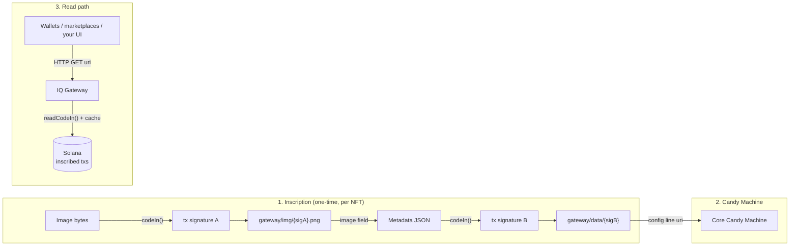

Most "on-chain" NFT collections are not actually on-chain. The mint lives on Solana, but the metadata JSON and the artwork usually live on IPFS pins, Arweave, or a plain web2 file host. If that hosting disappears, the NFT becomes a pointer to nothing.

With Code In you can put **every byte** of your collection on Solana, the image and the metadata JSON alike, and serve them to wallets and marketplaces through an [IQ Gateway](https://github.com/IQCoreTeam/iq-gateway). No IPFS, no Arweave, no pinning service.

This guide walks through the full flow for a [Metaplex Candy Machine](https://developers.metaplex.com/core-candy-machine) collection.

## Architecture



Per NFT:

1. Inscribe the image with `codeIn()` → you get a transaction signature. The image is now permanently on Solana, and its HTTP URL is `https://<gateway>/img/{sig}.png`.
2. Build the Metaplex metadata JSON with that URL in the `image` field, then inscribe the JSON itself → a second signature. Its URL is `https://<gateway>/data/{sig}` (raw bytes; `/meta/{sig}.json` serves a Metaplex-wrapped view).
3. Register the gateway URL as the item `uri` in your Candy Machine config lines.

The NFT's entire content chain (mint → uri → JSON → image) now resolves from Solana data.

## Why a gateway at all?

The gateway is an ordinary web2 HTTP server, so it is fair to ask why a fully on-chain setup needs one.

Wallets and marketplaces expect an NFT `uri` to be a plain HTTPS URL returning JSON, and an `image` URL returning bytes. They do not know how to reassemble Code In inscriptions from raw Solana transactions. So an NFT project runs a thin translation layer that pulls the inscription out of the chain and serves it over HTTP. That is exactly what the IQ Gateway is: a **read-only cache** that fetches on-chain data through the SDK and serves it with ETag/304 and multi-tier caching.

Why this is still a decentralized setup:

- **The gateway holds no data of its own.** Every byte is recoverable from Solana. The gateway is a cache, not a source of truth.
- **Anyone can run one.** The gateway is open source. If one instance dies, anyone can spin up another from the public repo and serve the exact same data.
- The only trust surface is the domain name in the `uri`. This is the same trade-off every IPFS-gateway-based collection already makes, with a strictly better recovery story.

### If your gateway goes down

Your NFTs do not break. The URLs in the minted metadata are just one door to data that lives on-chain. Every gateway addresses content the same way: `{gatewayBase}/img/{sig}.png`, `{gatewayBase}/data/{sig}`. The signature is the identity; the domain is interchangeable.

So to recover, take **any working gateway** (your own new instance, or someone else's), cut the path off the stored URL, and re-attach it to the new base:

```ts
// stored uri on a dead gateway:
// https://gw.dead.xyz/data/5Xg7abc...

const sig = storedUri.split('/').pop();          // "5Xg7abc..."
const uri = `https://gw.alive.xyz/data/${sig}`;  // same bytes, different door
```

Your frontend can even do this automatically: keep a small list of gateway bases and fall back to the next one when a fetch fails. The new gateway reconstructs identical content from the chain, because the chain is the source of truth.

## Step-by-step

### 1. Install the SDK

The SDK is published on npm. Install it, do not vendor or clone it:

```bash
npm i @iqlabs-official/solana-sdk
```

<Note>
Use the high-level API only: `iqlabs.writer.codeIn()` to inscribe and `iqlabs.reader.readCodeIn()` to verify. Do not reimplement chunking or session logic with the low-level instruction builders. `codeIn()` already picks the optimal storage path by size (&lt; 900 B inline, &lt; 8.5 KB linked-list, ≥ 8.5 KB parallel session upload) and handles the fee accounts.
</Note>

### 2. Inscribe the image and the metadata

```ts
import iqlabs from '@iqlabs-official/solana-sdk';

const GATEWAY = 'https://gw.yourdomain.xyz';

// 1. Inscribe the image (base64 string) → sigA
const sigA = await iqlabs.writer.codeIn(
  { connection, signer },
  imageBase64,
  'my-nft-001.png',
  0,
  'png'
);

// 2. Metadata JSON pointing at the gateway-served image → sigB
const json = JSON.stringify({
  name: 'My NFT #1',
  image: `${GATEWAY}/img/${sigA}.png`,
  // attributes, description, ...
});
const sigB = await iqlabs.writer.codeIn(
  { connection, signer },
  json,
  'my-nft-001.json',
  0,
  'json'
);

// 3. Candy Machine config line uri:
const uri = `${GATEWAY}/data/${sigB}`;
```

Loop this over your collection. A batch script over a few hundred assets is about 50 lines.

### 3. Register the URIs in your Candy Machine

Insert each `uri` into the Candy Machine config lines as usual (`addConfigLines` with mpl-core-candy-machine, or your deploy tooling). Nothing about the Candy Machine setup changes. It just points at gateway URLs instead of IPFS/Arweave ones.

### 4. Run your own gateway

Clone the gateway and deploy your own instance under your domain, configured for your cluster:

```bash
git clone https://github.com/IQCoreTeam/iq-gateway.git
cd iq-gateway && bun install
cp .env.example .env
# IQ_CHAIN=solana
# SOLANA_CLUSTER=mainnet-beta
# SOLANA_RPC_ENDPOINT=<your RPC>
bun run dev
```

Or with Docker:

```bash
docker build -t iq-gateway .
docker run -d -p 3000:3000 -v iq-cache:/app/cache --env-file .env --restart unless-stopped iq-gateway
```

Once deployed, the gateway serves interactive API docs at `/docs` and the spec at `/openapi.json`. The routes you need for NFTs are `/img/{sig}.png`, `/data/{sig}`, and `/meta/{sig}.json`.

<Note>
Test the full loop on devnet first (`SOLANA_CLUSTER=devnet`): inscribe a few assets, open the `/img` and `/data` URLs in a browser and in a wallet, then point a devnet Candy Machine at them before going to mainnet.
</Note>

## Costs

Two components, both in SOL:

**Inscription cost (network fees).** Data is chunked at 850 bytes per transaction, each paying the 5,000-lamport base fee, roughly **0.006 SOL per MB** of payload. Binary data is base64-encoded (+33%), so budget about **0.008 SOL per MB** of raw image, plus priority fees when the network is busy.

**Protocol fee.** Each `codeIn()` finalize sends a small size-dependent fee to the protocol, handled on-chain, observed at roughly **0.001 to 0.005 SOL per upload** on mainnet.

Illustrative total for a 777-piece PFP collection at ~150 KB per image plus ~1 KB of JSON:

| Component | Rough cost |
|---|---|
| 777 images (~117 MB raw, base64 ~155 MB), network fees | ~1 SOL |
| 777 metadata JSONs, network fees | ~0.01 SOL |
| Protocol fee, 1,554 uploads | ~2 to 8 SOL |

A one-time cost for a collection that never needs a pinning service, never expires, and can be served by any gateway anyone ever runs.
